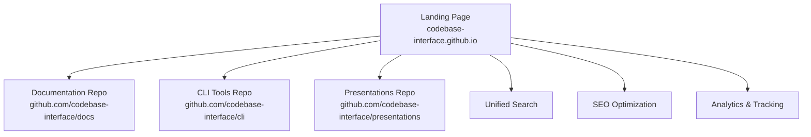

# Codebase Interface Landing Page

This repository contains the **landing page and aggregation site** for the Codebase Interface initiative - a comprehensive set of principles that promote ease of use of codebases across languages and frameworks.

🌐 **Live Site**: [codebase-interface.github.io](https://codebase-interface.github.io)

This landing page aggregates content from multiple repositories:

- **[Documentation](https://github.com/codebase-interface/docs)** - Comprehensive guides and principles
- **[CLI Tools](https://github.com/codebase-interface/cli)** - Command-line tools for implementation

- [Codebase Interface Landing Page](#codebase-interface-landing-page)
  - [Features](#features)
  - [Architecture](#architecture)
  - [Quick Start for Contributors](#quick-start-for-contributors)

## Features

- 🎯 **SEO-Optimized Landing Page** with structured data and meta tags
- 🔍 **Unified Search** across documentation and CLI tool repositories  
- 📱 **Responsive Design** with modern Material Design components
- ⚡ **Performance Optimized** with asset minification and caching
- 🤖 **Analytics Integration** for user engagement tracking
- ♿ **Accessibility Focused** with WCAG 2.1 compliance
- 🔄 **Automated Deployment** via GitHub Actions

## Badges

[](https://codebase-interface.github.io)
[](https://conventionalcommits.org)
[](https://squidfunk.github.io/mkdocs-material/)

> This repository follows the **Codebase Interface Principles** — for a better experience for everyone who works with it.

## Architecture

This landing page uses a **multi-repository architecture** to aggregate content:



### Repository Structure

| Repository | Purpose | Documentation |
|-|-|-|
| **Landing Page** (this repo) | SEO-optimized aggregation site | [README.md](README.md) |
| **[Documentation](https://github.com/codebase-interface/docs)** | Core principles and guides | Auto-imported |
| **[CLI Tools](https://github.com/codebase-interface/cli)** | Implementation tools | Auto-imported |
| **[Presentations](https://github.com/codebase-interface/presentations)** | Educational materials | Auto-imported |

### Local Documentation

| Link | Description |
|-|-|
| [CONTRIBUTING](CONTRIBUTING.md) | Guidelines for contributing to the landing page |
| [RUNBOOK](RUNBOOK.md) | How to deploy and maintain the landing page |
| [SUPPORT](SUPPORT.md) | Contact support for the landing page |
| [CHANGELOG](CHANGELOG.md) | Changes to the landing page infrastructure |
| [TODO](TODO.md) | Outstanding tasks for the landing page |
| [AGENTS](AGENTS.md) | AI agent documentation for landing page tasks |

## Quick Start for Contributors

### Development Setup

```bash
# Clone the repository
git clone https://github.com/codebase-interface/codebase-interface.github.io.git
cd codebase-interface.github.io

# Set up development environment
task setup

# Start local development server
task serve
# Visit: http://127.0.0.1:8000
```

### Available Commands

```bash
task setup          # Install dependencies
task serve          # Start development server
task build          # Build the site
task deploy         # Deploy to GitHub Pages
task lint           # Lint markdown and configuration
task validate       # Full site validation
task seo:audit      # Run SEO audit
task stats          # Show site statistics
```

### Content Updates

- **Landing page content**: Edit `index.md`, `about.md`, and assets
- **Documentation**: Updates automatically from [docs repository](https://github.com/codebase-interface/docs)
- **CLI tools**: Updates automatically from [CLI repository](https://github.com/codebase-interface/cli)

### Deployment

The site automatically deploys via GitHub Actions when changes are pushed to `main`. Manual deployment:

```bash
task deploy
```

**Note**: Follow [Conventional Commits](https://conventionalcommits.org) for automatic changelog generation.
