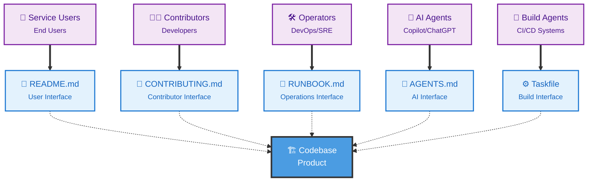

# Welcome

Welcome to the codebase interface initiative!

The codebase interface is a set of principles and practices that allow us to identify and understand all perspectives of interacting with a codebase, including contributors, users, operators, AI agents, and build agents.

By providing specific interfaces for each audience perspective, we can ensure that we help all users of the codebase by providing a great experience with clean and maintainable interfaces for all!

## Guide

- [Principles](./principles.md)
- [Audiences](./audiences.md)
- [Interfaces](./interfaces.md)
- [Benefits](./benefits.md)
- [Examples](./examples.md)
- [Tooling](./tooling.md)

## Overview

Remember your codebase is a product with multiple users. We should treat it as such by providing great experiences for all audiences that interact with it.

## Overview

Remember your codebase is a product with multiple users. We should treat it as such by providing great experiences for all audiences that interact with it.



## Support

If your codebase uses codebase interface principles please support the initiative by starring the [Codebase Interface GitHub repository](https://github.com/codebase-interface/codebaseinterface){target="_blank"} and placing the below markdown in the README of your repo.

### Badges

#### Primary

```md
[](https://codebaseinterface.org)

> This repository follows the **Codebase Interface Principles** — for a better experience for everyone who works with it.
```

#### Simple

```md
[](https://codebaseinterface.org)
```

#### Footer

```md
_Follows the [Codebase Interface Principles](https://codebaseinterface.org)._
```
